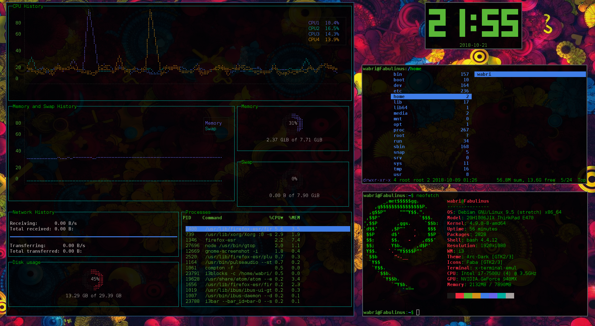
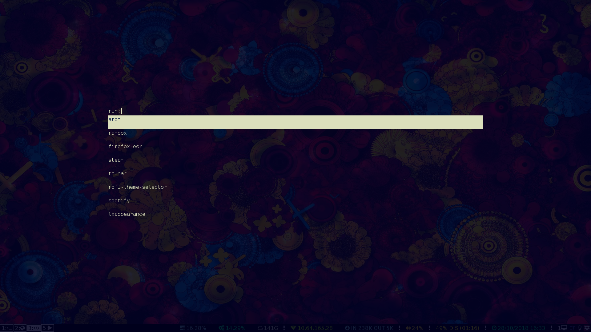
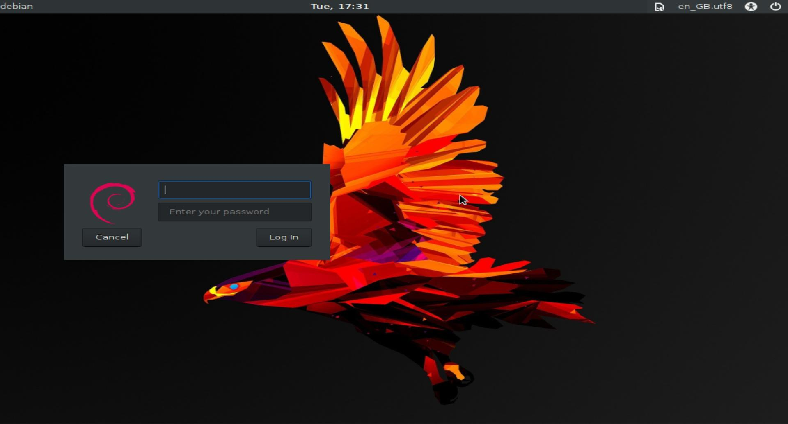
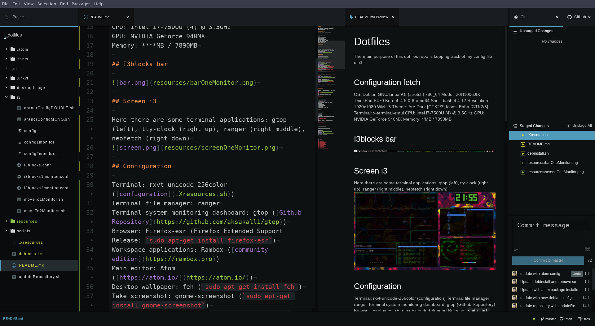

# Dotfiles

## index

0.  [Screen i3](#screen-i3)
1.  [I3blocks bar](#i3blocks-bar)
2.  [Rofi](#rofi-window-switcher-application-launcher-and-dmenu-replacement)
3.  [LightDm](#login-lightdm)
4.  [Atom](#atom-configurations)
5.  [URxvt](#urxvt)
6.  [Configuration List](#configuration)
7.  [Installation](#installation---debian-9-stretch)
8.  [My device info](#my-device-info)

*********

## Screen i3

Here there are some terminal applications: gtop (left), tty-clock (right up), ranger (right middle), neofetch (right down)

********

## I3blocks bar

********

## Rofi window switcher, application launcher and dmenu replacement

********

## Login Lightdm

********

## Atom configurations

UI theme: seti ([seti-ui](https://atom.io/themes/seti-ui))

    apm install seti-ui

Syntax theme: seti ([seti-syntax](https://atom.io/themes/seti-syntax))

    apm install seti-syntax

Atom packages dependencies (for python):

    sudo apt install python-pip
    sudo -H pip install pep8 autopep8 flake8 flake8-docstrings

Atom theme:

    apm install seti-ui seti-syntax

Atom packages

1.  for python ide:

    `apm install linter linter-flake8 sort-lines highlight-line autocomplete-python`

2.  for cpp ide:

    `apm instal linter-cpplint`

3.  for markdown editor:

    `apm install language-markdown`

4.  for minimap, run scripts and beautify code:

    `apm install minimap script atom-beautify`

5.  other:

    `apm install hey-pane`

For the atom-beautify packages there are other dependencies:

1.  docker

    `sudo curl -sSL https://get.docker.com/ | sh`

2.  python beautify:

    `sudo -H docker pull unibeautify/autopep8`

3.  bash script beautify:

    `sudo -H docker pull unibeautify/beautysh`

4.  cpp and other beautify:

    `sudo -H docker pull unibeautify/uncrustify`

********

## URxvt

The configuration is [.Xresources](.Xresources)
You can find all the scripts use in the folder [.urxvt](.urxvt/):

-   font-size
-   fullscreen
-   url-select

To create opacity effects i use compton, to install:

    sudo apt install compton

To use add this line to your i3 configuration:

    exec_always compton -f

********

## Configuration

**Terminal**: rxvt-unicode-256color -> `sudo apt install rxvt-unicode-256color`

**Display manager**: Lightdm -> `sudo apt install lightdm lightdm-gtk-greeter`

**Terminal file manager**: ranger -> `sudo apt install ranger`

**Terminal system monitoring dashboard**: gtop -> [Github Repository](https://github.com/aksakalli/gtop)

**Browser**: Firefox Extended Support Release -> `sudo apt-get install firefox-esr`

**Workspace applications wrapper**: Rambox -> [community edition](https://rambox.pro)

**Main editor**: Atom -> <https://atom.io/>

**Desktop wallpaper**: feh -> `sudo apt-get install feh`

**Take screenshot**: gnome-screenshot -> `sudo apt-get install gnome-screenshot`

**Audio manager**: playerctl -> `sudo apt-get install playerctl`

**Applications launcher**: rofi -> `sudo apt-get install rofi`

**Theme switcher**: lxappearance -> `sudo apt-get install lxappearance`

**Monitor configurations**: arandr -> `sudo apt-get install arandr`

**Battery monitor**: i3-battery-popup -> [Github Repository](https://github.com/rjekker/i3-battery-popup)

**Brightness controller**: light -> [Github repository](https://github.com/haikarainen/light)

**Keyboard events catcher**: xev -> `sudo apt-get install xev`

********

## Installation - Debian 9 stretch

**Minimal spaces for this configuration: >15GB**

First of all you need to be in the sudoers:

    $ usermod -aG sudo <username>

Then you must have wget install, you can install by apt:

    $ apt install wget

To install all the configuration you have to download debinstall-absolute.sh bash file and then run it:

    wget https://raw.githubusercontent.com/Wabri/dotfiles/master/debinstall-absolute.sh ;
    ./debinstall-absolute.sh

or without download the script:

    curl -sL https://raw.githubusercontent.com/Wabri/dotfiles/master/debinstall-absolute.sh | sudo bash -

You can see the contents of this file here [debinstall-absolute.sh](debinstall-absolute.sh)

********

## My Device info

OS: Debian GNU/Linux 9.5 (stretch) x86_64

Model: 20H1006JIX ThinkPad E470

Kernel: 4.9.0-8-amd64

Shell: zsh 5.3.1

Resolution: 1920x1080

WM: i3

Theme: Arc-Dark [GTK2/3]

Icons: Numix [GTK2/3]

Terminal: x-terminal-emul

CPU: Intel i7-7500U (4) @ 3.5GHz

GPU: NVIDIA GeForce 940MX

Memory: \*\*\*\*MB / 7890MB
