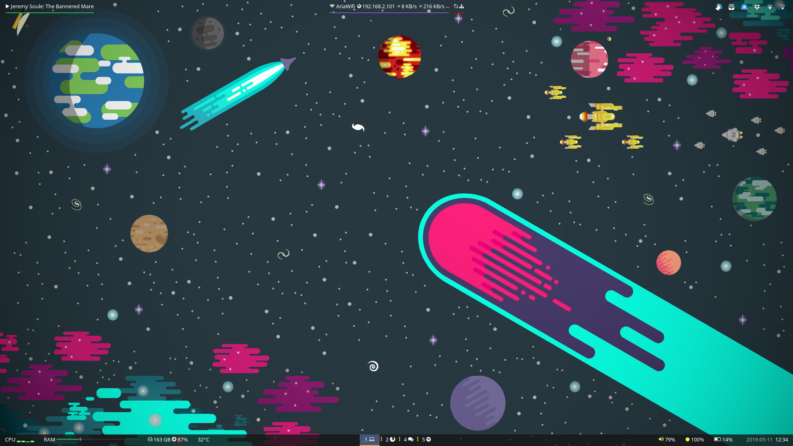
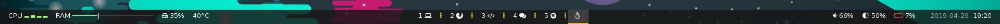
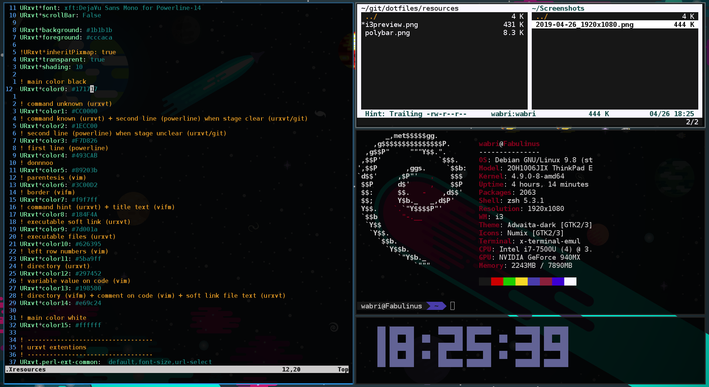
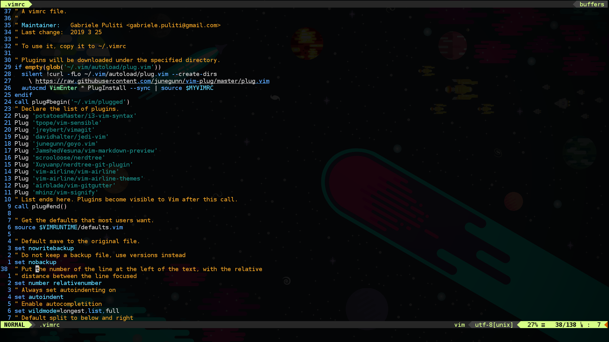
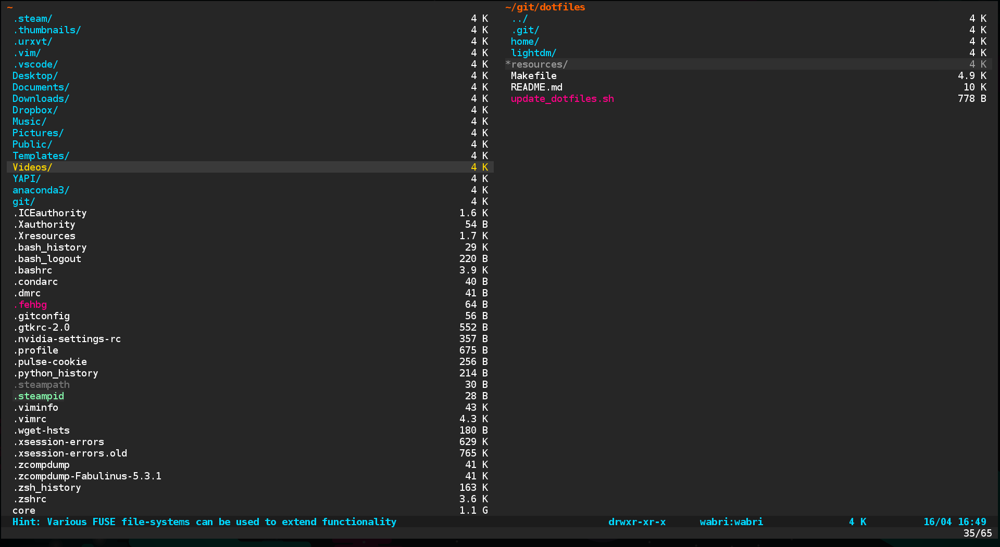
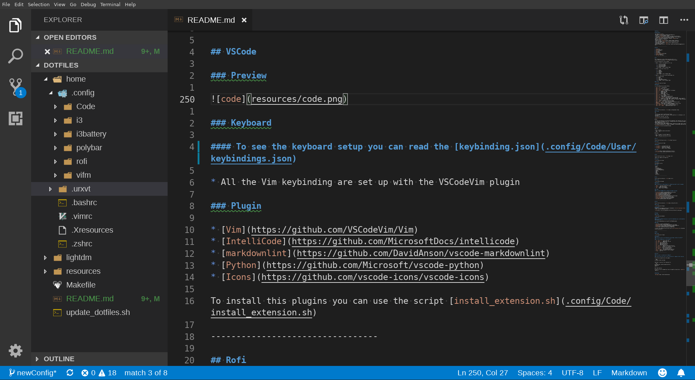
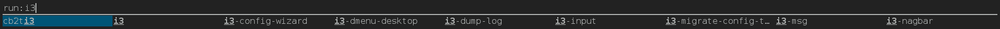

# Dotfiles

## Some details

* OS: Debian 9 (stretch)
* WM: I3wm ([i3-gaps](https://github.com/Airblader/i3))
* Terminal: rxvt-unicode-256color (URxvt)
* Shell: zsh ([oh-my-zsh](https://github.com/robbyrussell/oh-my-zsh))
* File Manager: [vifm](https://vifm.info/) (terminal), thunar (graphical)
* Launcher: [Rofi](https://github.com/davatorium/rofi)
* Editor: [Vim](https://www.vim.org/) (terminal), [VSCode](https://code.visualstudio.com/) (graphical)
* Browser: Firefox
* Battery warning: [i3battery](https://github.com/wabri/i3battery)
* Control backlights: [light](https://github.com/haikarainen/light)
* Mail client: [Mailspring](https://getmailspring.com/)
* Chat application: Telegram, [Rambox](https://getmailspring.com/)
* Music player: Spotify
* External package installer: [YAPI](https://github.com/YetAnotherPackageInstaller/YAPI)

---------------------------------

## Index

1. [I3wm](#i3)
2. [Polybar](#polybar)
3. [Urxvt](#urxvt)
4. [Zsh](#zsh---oh---my---zsh)
5. [Vim](#vim)
6. [Vifm](#vifm)
7. [Visual Studio Code](#vscode)
8. [Install](#install)
9. [WallPaper](#wallpaper)

---------------------------------

## I3

This configuration is Vim oriented (move keys with h-j-k-l).
You can find the config here -> [file](home/.config/i3/config)

### Preview

Full:



* up left -> [gtop](https://github.com/aksakalli/gtop)
* up right up -> tty-clock
* up right down -> cmatrix
* down left -> neofetch
* down right -> [vifm](#vifm)

Clean:


### Keyboard

I use the windows key as my main mod key.

* `super + enter` -> new terminal
* `super + d` -> launch rofi
* `super + shift + q` -> close container
* `super + [1-0]` -> change workspace
* `super + shift + [1-0]` -> move container to workspace
* `super + g` -> toggle split mode
* `super + f` -> toggle fullscreen
* `super + w` -> layout tabbed
* `super + e` -> toggle layout split
* `super + r` -> resize mode
* `super + Shift + o` -> toggle floating
* `super + o` -> focus floating
* `super + h/l` -> move right/left container view
* `super + j/k` -> move down/up container view
* `super + Shift + h/j/k/l` -> move container left/down/up/right
* `super + p` -> system control mode (logout, suspend, hibernate, reboot, poweroff)
* `super + s` -> spotify control mode (play, pause, next, previous, toggle play/pause)
* `super + Shift + x` -> lock screen
* `print` -> grab a screenshoot of the active window
* `super + print` -> select area to grab to screenshot
* `super + Shift + print` -> grab a screenshoot of the entire screen
* `XF86Tools` -> open with vim the config file
* `XF86Display` -> open arandr for graphical management of monitor view
* `super + backslash` -> open vifm in the home directory
* `super + Shift + comma` -> create a new file and edit with vim
* `super + Shift + ograve` -> open mailspring mail client
* `super + v` -> open empty vim in home directory
* `super + -` -> open gtop
* `super + comma` -> open .Xresources with vim
* `super + period` -> open .vimrc with vim
* `super + backslash` -> open vifm

### Modes

For this configuration I use this modes:

1. Resize -> default resize modality of i3, use:

    * l -> resize shrink width
    * j -> resize grow height
    * k -> resize shrink height
    * h -> resize grow width
    * q or Escape -> return to default mode

2. [System](home/.config/i3/i3exit) -> use to exit from i3, use:

    * l -> logout
    * s -> suspend
    * h -> hibernate
    * r -> reboot
    * p -> shutdown
    * q or Escape -> return to default mode

3. [Spotify](home/.config/i3/i3spotify) -> use to control spotify desktop app, use:

    * h -> previous song
    * j -> pause
    * k -> play
    * l -> next song
    * s -> toggle pause and play
    * q or Escape -> return to default mode

### Install

***Not yet tested***

Make argument:

* Basic dependencies:

    ```Bash
    make i3
    ```

* All dependencies:

    ```Bash
    make i3_all
    ```

---------------------------------

## Polybar

You can find the config here -> [file](home/.config/polybar/config)

### Preview

Top:

* On the corner top left: spotify view of song
* On the middle top: wireless connection, wired connection (it's red because is not connected)
* On the corner top right: tray icons


Bottom:

* On the corner bottom left: cpu status with animated bar that represents the 4 cores, rap status with the animated status bar, filesystem status with free and percentage of usage, temperature of core.
* On the middle bottom: i3wm workspaces
* On the corner bottom right: volume percentage, brightness percentage, battery status with animated charging and color change if the adapter is disconnected, date and time



### Modules

Upper bar:

* left -> spotify
* center -> wireless-network wired-network
* right -> tray

Bottom bar:

* left -> cpu memory filesystem temperature
* center -> i3
* right -> pulseaudio backlight battery date

### Install

***Not yet tested***

Make argument:

```Bash
make polybar
```

---------------------------------

## Urxvt

You can find the Xresources here -> [file](home/.Xresources)

## Preview



### Keyboard

* `Ctrl++` -> increase the font size
* `Ctrl+-` -> decrease the font size
* `Ctrl+Shift+c` -> copy to the clipboard
* `Ctrl+Shift+v` -> paste from the clipboard

### Plugin

* [font-size](https://github.com/johntyree/urxvt-perls)
* [url-select](https://github.com/johntyree/urxvt-perls)

### Install

***Not yet tested***

Make argument:

```Bash
make urxvt
```

---------------------------------

## Zsh - Oh-My-Zsh

You can find the zshrc here -> [file](home/.zshrc)

Theme in use: agnoster with powerline

## Preview


### Keyboard

Vim bindkey is active.

### Plugin

* debian
* git
* colorize
* zsh-completions
* zsh-autosuggestions
* zsh-syntax-highlighting
* copydir
* copyfile
* sudo
* themes
* vscode
* web-search

### Install

***Not yet tested***

Make argument:

```Bash
make zsh
```

---------------------------------

## Vim

You can find the config here -> [file](home/.vimrc)

### Preview



### Keyboard

#### To abilitate the copy and paste to clipboard you need to install vim-gnome

* `Ctrl+\` -> open the nerd tree
* `<F2>` -> copy to the clipboard
* `<F3>` -> paste from the clipboard
* `Ctrl+<motion>` -> move line/s
* `Ctrl+w <motion>` -> switch between splitted editor
* `Ctrl+d` -> switch to bash terminal
* `Space+f` -> folding
* `Space+>` -> switch to next tab
* `Space+<` -> switch to previous tab

### Plugin

#### I'm using [plugged](https://github.com/junegunn/vim-plug)

* [i3-vim-syntax](https://github.com/potatoesMaster/i3-vim-syntax)
* [vim-sensible](https://github.com/tpope/vim-sensible)
* [jedi-vim](https://github.com/davidhalter/jedi-vim)
* [gojo.vim](https://github.com/junegunn/goyo.vim)
* [nerdtree](https://github.com/scrooloose/nerdtree)
* [nerdtree-git-plugin](https://github.com/Xuyuanp/nerdtree-get-plugin)
* [vim-airline](https://github.com/vim-airline/vim-airline)
* [vim-airline-themes](https://vim-airline/vim-airline-themes)
* [tpope/vim-fugitive](https://github.com/tpope/vim-fugitive)
* [vim-gitgutter](https://github.com/airblade/vim-gitgutter)
* [vim-signify](https://github.com/mhinz/vim-signify)
* [vim-polyglot](https://github.com/sheerun/vim-polyglot)
* [jellybeans.vim](https://github.com/nanotech/jellybeans.vim)
* [luochen1990/rainbow](https://github.com/nanotech/luochen1990/rainbow)
* [matze/vim-move](https://github.com/nanotech/matze/vim-move)
* [vim-ctrlspace](https://github.com/vim-ctrlspace/vim-ctrlspace)

### Install

***Not yet tested***

Make argument:

```Bash
make vim
```

---------------------------------

## Vifm

You can find the config here -> [file](home/.config/vifm/vifmrc)

### Preview



### Keyboard
To see all of the keyboard shortcut go to cheatsheets: [vifm.info/cheatsheets.shtml](https://vifm.info/cheatsheets.shtml):


### Install

Make argument:

```Bash
make vifm
```

---------------------------------

## VSCode

### Preview



### Keyboard

#### To see the keyboard setup you can read the [keybinding.json](.config/Code/User/keybindings.json)

* All the Vim keybinding are set up with the VSCodeVim plugin

### Plugin

* [Vim](https://github.com/VSCodeVim/Vim)
* [IntelliCode](https://github.com/MicrosoftDocs/intellicode)
* [markdownlint](https://github.com/DavidAnson/vscode-markdownlint)
* [Python](https://github.com/Microsoft/vscode-python)
* [Icons](https://github.com/vscode-icons/vscode-icons)

To install this plugins you can use the script [install_extension.sh](.config/Code/install_extension.sh)

### Install

***Not yet tested***

Make argument:

```Bash
make code
```

---------------------------------

## Rofi

### Preview



### Keyboard

#### ***You can see all the configuration [here](home/.config/rofi/config)***

#### ***This configuration is vim oriented***

* `Alt + Shift + d` -> Clear input line
* `Alt + Shift + i` -> Beginning of the line
* `Alt + Shift + a` -> End of line
* `Alt + b` -> Move back one word
* `Alt + w` -> Move forward one word
* `Alt + h` -> Move back one char
* `Alt + l` -> Move forward one char
* `Alt + Shift + c` -> Delete till the end of the line
* `Alt + Shift + s` -> Delete till the start of the line
* `Control + Tab` -> Switch to the next mode
* `Alt + Shift + h` -> Go to the previous column
* `Alt + Shift + l` -> Go to the next column
* `Control + Space` -> Set selected item as input text
* `Alt + s` -> Take a screenshot of the rofi window
* `Escape` -> Quit rofi

### Install

***Not yet tested***

Make argument:

```Bash
make rofi
```

---------------------------------

## Install

***Not yet tested***

### This install is tested only for Debian 9

### I do not ensure the result of the installation for computers other than mine

First of all, you need to be in the sudoers:

```Bash
$ usermod -aG sudo <username>
```

Download or clone one of the release and run:

```Bash
git clone https://github.com/wabri/dotfiles
cd dotfiles
make all
```

Now reboot and prey.

Or you can follow the commands you find on the makefile step by step -> [makefile](Makefile)

---------------------------------

## WallPaper


